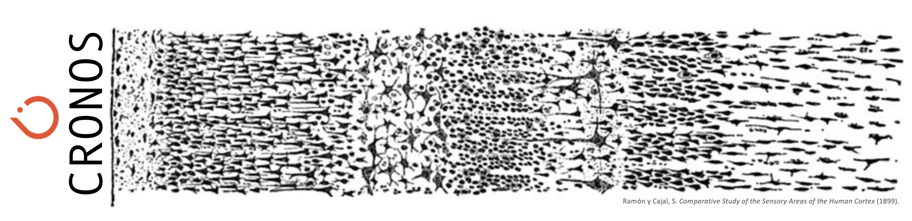

I am a neuroengineer and AI scientist with a background in physics and digital signal processing. I am interested in decoding brain function using data driven paradigms in order to inform Large Scale Models.
I am the developer of Neurocraft, the Microscale Neuroengineering Platform.

