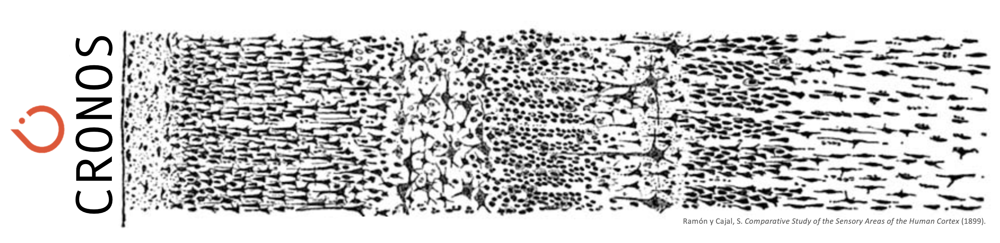

I am a neuroengineer and AI scientist with a background in physics and digital signal processing. I am interested in decoding brain function using data driven paradigms in order to inform Large Scale Models.
I am the developer of [Neurocraft, the Microscale Neuroengineering Platform](https://github.com/Neurocraft/neurocraft).

[gh-site]: https://pages.github.com/
[minima]: https://github.com/jekyll/minima/tree/2.5-stable
[jk]: https://jekyllrb.com/
[gh]: https://help.github.com/en/github/working-with-github-pages`
