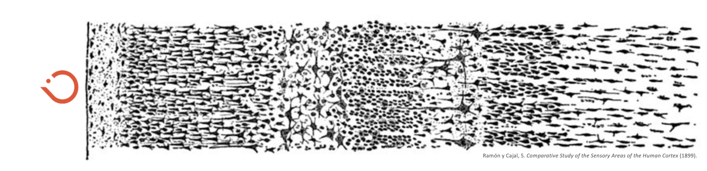

<!--  -->

  

[gh-site]: https://pages.github.com/
[minima]: https://github.com/jekyll/minima/tree/2.5-stable
[jk]: https://jekyllrb.com/
[gh]: https://help.github.com/en/github/working-with-github-pages`
