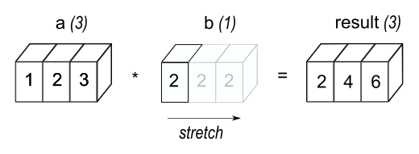
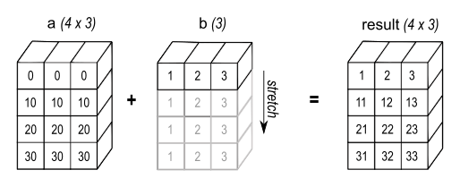
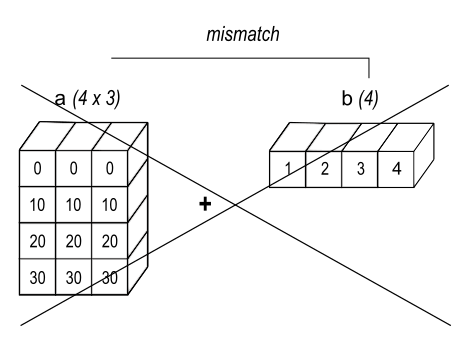
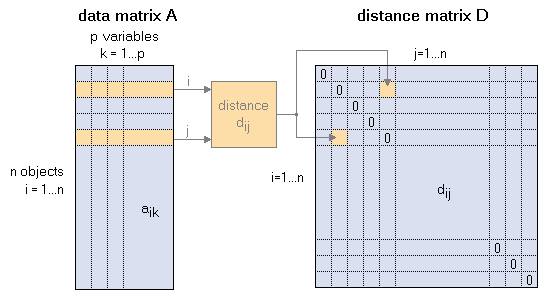

::: {.cell .markdown id="DDN_5ck6ZMcl"}
# Array Broadcasting: A visual explanation with code. {#array-broadcasting-a-visual-explanation-with-code}

The term broadcasting describes how NumPy treats arrays with different
shapes during arithmetic operations. Subject to certain constraints, the
smaller array is "broadcast" across the larger array so that they have
compatible shapes.

**Broadcasting provides a means of vectorizing array operations so that
looping occurs in C instead of Python.** It does this without making
needless copies of data and usually leads to efficient algorithm
implementations. There are, however, cases where broadcasting is a bad
idea because it leads to inefficient use of memory that slows
computation.

In the following multiplication operation between a (3,1) array and
ascalar, numpy broadcasts copies of the scalar `b` across the required
dimension so that the operation can be done as a pair of arrays on an
element-by-element basis.
:::

::: {.cell .code colab="{\"base_uri\":\"https://localhost:8080/\"}" id="203YUEMMxTUb" outputId="f8f4afbd-dcb7-4b45-f938-7d710177fa0a"}
``` python
import numpy as np

a = np.array([1.0, 2.0, 3.0])
b = 2.0
a * b
```

::: {.output .execute_result execution_count="3"}
    array([2., 4., 6.])
:::
:::

::: {.cell .markdown id="pR1Q8gm0xb9Y"}
The result of the above is the equivalent of

    a = np.array([1.0, 2.0, 3.0])
    b = np.array([2.0, 2.0, 2.0])
    a * b
    >>> array([ 2.,  4.,  6.])

The new elements in b, as shown in Figure below, are simply copies of
the original scalar.In fact NumPy uses the original scalar value without
actually making copies so that broadcasting operations are as memory and
computationally efficient as possible.


Image source: <https://numpy.org/>

The code in the first example is more efficient than that in the first
because broadcasting moves less memory around during the multiplication
(b is a scalar rather than an array).
:::

::: {.cell .markdown id="Khc0uqzOzoMU"}
## General Broadcasting Rules

1.  When operating on two arrays, NumPy compares their shapes
    element-wise. It starts with the trailing (i.e. rightmost)
    dimensions and works its way left. Two dimensions are compatible
    when  

-   they are equal, or
-   one of them is 1
    If these conditions are not met, a
    `ValueError: operands could not be broadcast together` exception is
    thrown, indicating that the arrays have incompatible shapes. The
    size of the resulting array is the size that is not 1 along each
    axis of the inputs.

1.  Arrays do not need to have the same number of dimensions. For
    example, if you have a 256x256x3 array of RGB values, and you want
    to scale each color in the image by a different value, you can
    multiply the image by a one-dimensional array with 3 values. Lining
    up the sizes of the trailing axes of these arrays according to the
    broadcast rules, shows that they are compatible:

```{=html}
<!-- -->
```
    Image  (3d array): 256 x 256 x 3
    Scale  (1d array):             3
    Result (3d array): 256 x 256 x 3

When either of the dimensions compared is one, the other is used. **In
other words, dimensions with size 1 are stretched or "copied" to match
the other.**

1.  A set of arrays is called "broadcastable" to the same shape if the
    above rules produce a valid result.
    For example, if a.shape is (5,1), b.shape is (1,6), c.shape is (6,)
    and d.shape is () so that d is a scalar, then a, b, c, and d are all
    broadcastable to dimension (5,6); and

-   a acts like a (5,6) array where a\[:,0\] is broadcast to the other
    columns,
-   b acts like a (5,6) array where b\[0,:\] is broadcast to the other
    rows,
-   c acts like a (1,6) array and therefore like a (5,6) array where
    c\[:\] is broadcast to every row, and finally,
-   d acts like a (5,6) array where the single value is repeated.




Image source: <https://numpy.org/>
:::

::: {.cell .markdown id="NPqEneYl0l3W"}
## Application: Euclidean Distance Matrix

To calculate the euclidean distance matrix in a dataset (m observations,
n variables), we would have to iterate over the the rows/observations of
the data matrix so that a value is calculated all possible combinations
of observations based on the following equation:

${\displaystyle {\begin{aligned}d(\mathbf {p} ,\mathbf {q}) &={\sqrt {\sum _{i=1}^{n}(q_{i}-p_{i})^{2}}}.\end{aligned}}}$

We will compare for-loop and a mattrix multiplication operation in terms
of speed.
:::

::: {.cell .code id="BsQzxtmPpE5j"}
``` python
from sklearn.datasets import load_iris

data, _ = load_iris(return_X_y=True)
```
:::

::: {.cell .markdown id="OfxNPI2l49h6"}
In our data matrix A, as a first step of the euclideal matrix
calculation we would like to

-   Subtract each $m_{i}$ row with every other $m_{j}$ row (data matrix
    A in figure below)
-   Calculate the square root of the cube each pair subtraction pair
-   Calculate the sum across the dimension of variables.

### For-loop calculation
:::

::: {.cell .code id="1vKxMTns5GPn"}
``` python
def eucl_loop(A):
    result = np.zeros((data.shape[0],data.shape[0]), dtype = int)
    for i,_ in enumerate(data):
        for j,_ in enumerate(data): 
            result[i][j] = np.sqrt(np.sum((data[i,:]-data[j,:])**2))
    return result
```
:::

::: {.cell .markdown id="vRsxhmKqjjCv"}
### Matrix multiplication calculation

To do the above as a matrix operation with the help of broadcasting we
are going to

1.  Generate a $D = (m_{i} \times (m_{j} \times n))$ matrix where
    $(m_{j} b. times n)$ repsresents a slice \"that belongs\" to
    datapoint $m_{i}$ and includes all other datapoints. Subtracting
    $m_i$ from \"their\" slice will result in a slice consisting of all
    subtraction operations of $m_i$ with every other $m_j$ datapoint
    across all variables. To do the above we will

-   add an additional dummie dimension to $A$ data matrix and rotate it
    so that $m \times 1$ view is exposed and store it as $B$.
-   rotate $B$ so that $1 \times m$ view is exposed.
-   Given we have a broadcastable pairs matrices because
    $(1 \times m)$$(m \times 1)$ the subtruct operation is going to
    strech across $m$ generating the desired $D$ matrix. 

1.  Calculate the cube of all elements of $D$.
2.  Sum across the $n$ dimension of the matrix and calculate the square
    root. That is the Euclidean distance matrix $E$. 

The above will result the matrix $E$, as seen in the figurbelow. The
distance matrix is going to be a symmetric quadratic matrix of size
$(m \times m)$ which contains all zeroes along the main diagonal (the
distance of each object and a replica of itself is zero).


image source: <http://www.statistics4u.com/>
:::

::: {.cell .markdown id="lc0F0JyiU39i"}
Performing A to B calculation above:
:::

::: {.cell .code colab="{\"base_uri\":\"https://localhost:8080/\"}" id="zUZ4lX_0pLqz" outputId="73988a75-cc25-4442-e080-9ff8569756c1"}
``` python
 # Adding dummie dimension
B = data[:,:, None]
print(B.shape)

B = np.rot90(B, 1, (1,2))
print(B.shape)
```

::: {.output .stream .stdout}
    (150, 4, 1)
    (150, 1, 4)
:::
:::

::: {.cell .markdown id="-bsAtvObYKON"}
Performing the B to C calculation from diagram above:
:::

::: {.cell .code colab="{\"base_uri\":\"https://localhost:8080/\"}" id="UfHm779v8rYt" outputId="2b5666db-320b-4a65-97f2-64f0a368bdab"}
``` python
C = np.rot90(B,1,(0,1))
print(C.shape)
```

::: {.output .stream .stdout}
    (1, 150, 4)
:::
:::

::: {.cell .markdown id="95EX53Yj6jDG"}
The dimensions of our matrices appear to be broadcastable. We can
proceed with the subtraction operation. See how the first row of the
first slice of D matrix is zeroes, because the first datapoint is
subtracted to itself. Same applies for the second row of the second
slice and so forth.
:::

::: {.cell .code colab="{\"base_uri\":\"https://localhost:8080/\"}" id="c4-Neaim6sw5" outputId="973f95b1-195e-439d-e6ed-68869e95e04f"}
``` python
D = B - C
print(D[0][0:5])
print(D[1][0:5])
```

::: {.output .stream .stdout}
    [[ 0.   0.   0.   0. ]
     [ 0.2  0.5  0.   0. ]
     [ 0.4  0.3  0.1  0. ]
     [ 0.5  0.4 -0.1  0. ]
     [ 0.1 -0.1  0.   0. ]]
    [[-0.2 -0.5  0.   0. ]
     [ 0.   0.   0.   0. ]
     [ 0.2 -0.2  0.1  0. ]
     [ 0.3 -0.1 -0.1  0. ]
     [-0.1 -0.6  0.   0. ]]
:::
:::

::: {.cell .markdown id="D2FVFDffhocH"}
Calculate finally the Euclidean distance perfor ing final operations.
:::

::: {.cell .code colab="{\"base_uri\":\"https://localhost:8080/\"}" id="faiBs24e8tu2" outputId="43cd5bc5-35e1-438c-9a5d-1dcf75500396"}
``` python
Euc_mat = np.sqrt(np.sum(D**2, axis=2))
print(Euc_mat.shape)
```

::: {.output .stream .stdout}
    (150, 150)
:::
:::

::: {.cell .markdown id="LtlBUdd_jkX7"}
The above can be summarised in the following function:
:::

::: {.cell .code id="c_sA4oi1jr2i"}
``` python
def eucl_matmul(A):
    # generate distance matrix:
    B = np.rot90(A[:,:,None],1,(1,2)) #[:,:,None] is needed to add a dimension
    C = np.rot90(B,1,(0,1))
    return np.sqrt(np.sum((B-C)**2, axis=2))
```
:::

::: {.cell .markdown id="BI_dbfEG7r7P"}
## Why though?

Let\'s compare runtimes between the `for-loop` and `matmul`
methodologies.
:::

::: {.cell .code colab="{\"base_uri\":\"https://localhost:8080/\"}" id="puakxPo6kL4G" outputId="8dba1ea0-4767-4222-9b04-9f7ed5afcaa7"}
``` python
%timeit A = eucl_matmul(data) 
%timeit B = eucl_loop(data)
```

::: {.output .stream .stdout}
    1000 loops, best of 5: 1 ms per loop
    1 loop, best of 5: 221 ms per loop
:::
:::

::: {.cell .markdown id="_KoD19FGVyOs"}
## Sources

-   <https://numpy.org/doc/stable/user/basics.broadcasting.html#>:\~:text=The%20term%20broadcasting%20describes%20how,that%20they%20have%20compatible%20shapes.
-   <https://towardsdatascience.com/performing-multidimensional-matrix-operations-using-numpys-broadcasting-cf33e3029170>
-   <https://machinelearningmastery.com/broadcasting-with-numpy-arrays/>
-   <http://www.statistics4u.com/fundstat_eng/cc_distance_matrix.html>
:::

::: {.cell .code id="FhGJmlJ9V3Bo"}
``` python
```
:::
